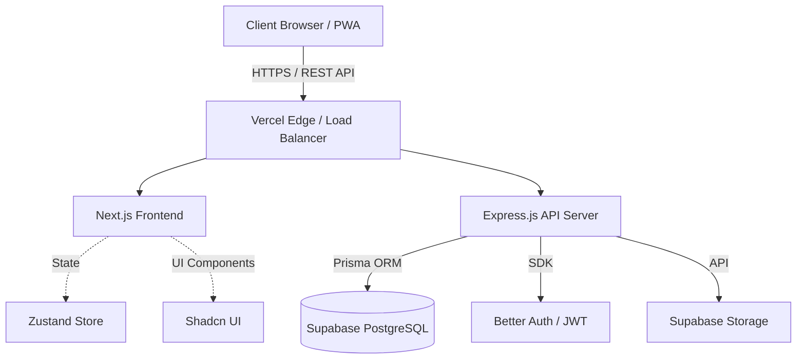

# Product Requirements Document (PRD): Sistem HRIS Enterprise

**Product:** Sistem HRIS (Human Resource Information System)
**Author & Creator:** Ahmad Arif (HRISCorp.dev)
**License:** HRISCorp.dev Enterprise License by Ahmad Arif
**Date:** 2026-08-08
**Version:** v1.0
**Status:** Approved & Implemented

## Executive Summary
Dokumen ini mendefinisikan persyaratan, arsitektur, desain database, dan breakdown fitur untuk Sistem HRIS perusahaan. Sistem ini dirancang untuk menjadi fondasi terpusat yang mengelola seluruh siklus hidup karyawan mulai dari rekrutmen, manajemen data (karyawan, kontrak), kehadiran, penggajian, hingga evaluasi kinerja. Arsitektur dibangun dengan standar skalabilitas tinggi (Next.js + Express + PostgreSQL) dan menerapkan prinsip *Zero Hardcoded Master Data* untuk fleksibilitas maksimal.

### Metrik Keberhasilan (KPIs)
*   **Efisiensi Payroll:** Pengurangan waktu proses kalkulasi gaji masif hingga 80%.
*   **Adopsi Pengguna:** Target penggunaan (Active Users) oleh 95% karyawan dalam 1 bulan peluncuran.
*   **Reliabilitas Sistem:** *Zero downtime* selama jam absensi puncak (misal: 07.30 - 08.30).

---

## 1. Arsitektur Proyek (Project Architecture)

Sistem HRIS ini dirancang menggunakan arsitektur modern berbasis microservices/modular monolith dengan pemisahan yang jelas antara frontend dan backend, memastikan skalabilitas dan keamanan tingkat tinggi.

### 1.1 Tech Stack
*   **Arsitektur Frontend:** Monorepo (Turborepo) untuk memisahkan portal secara independen (Admin Dashboard, Employee Portal, Vendor Portal).
*   **Frontend (Web & Dashboard):** Next.js (App Router), React, Tailwind CSS v4, Zustand (State Management), Shadcn UI, dan Framer Motion. Dibangun berbasis standar *HRISCorp.dev Design System*, dilengkapi *library* pendukung seperti ApexCharts, FullCalendar, dan Flatpickr. Didukung fitur **i18n (Internationalization)** untuk multi-bahasa.
*   **Backend (API):** Node.js dengan Express JS (TypeScript).
*   **Database & Cache:** Supabase PostgreSQL sebagai *primary DB*, dan **Redis Cache** untuk mempercepat kueri *Master Data* berskala masif.
*   **ORM:** Prisma ORM (Wajib menerapkan aturan `Soft Delete` dengan kolom `deleted_at` untuk semua model guna mencegah hilangnya riwayat data).
*   **Authentication & Authorization:** Better Auth + JWT Token (Role-Based Access Control / RBAC ketat).
*   **Storage:** Supabase Bucket Storage (untuk pas foto, dokumen kontrak, CV lamaran, dll).
*   **Quality Assurance (QA) Stack:** Vitest untuk *Unit Testing* backend, Playwright/Cypress untuk *E2E Testing* frontend, dan k6/JMeter untuk *Load Testing*.
*   **Application Performance Monitoring (APM):** **Sentry** untuk pelacakan *error/crash* secara *real-time* di sisi *Frontend* maupun *Backend*.

### 1.2 Diagram Arsitektur

### 1.3 Metodologi Pengembangan (Development Methodologies)
Untuk menjaga agar *codebase* tetap bersih, *maintainable*, dan bebas *bug*, pengembangan akan mematuhi prinsip-prinsip *engineering* berikut untuk masing-masing *role*:

#### A. Backend Engineering (/backend)
*   **Clean Architecture:** Pemisahan lapisan kode secara ketat menjadi **Controller** (menangani HTTP Request/Response), **Service** (mengeksekusi *business logic* HR yang kompleks), dan **Repository** (interaksi eksklusif dengan Prisma/Database).
*   **Result Pattern:** Standarisasi semua respon API (*wrapper* respons HTTP). Sistem harus merespon dalam struktur seragam (seperti `isSuccess`, `data`, `error`, `message`), mempermudah *frontend* mengkonsumsi API.
*   **Guard Clauses (Early Returns):** Semua *endpoint* harus memvalidasi kondisi atau *payload* di baris paling awal dan langsung me-*reject* dengan *error* (menghentikan eksekusi lebih awal) jika validasi gagal. Ini mencegah kode `if-else` bersarang atau *arrow anti-pattern*.
*   **Centralized Error Handling:** Seluruh *error* yang dilempar dari *Services* ditangkap oleh *middleware* tunggal agar respon kesalahan *server* atau *client* konsisten.
*   **Security & Rate Limiting:** Mengingat tingginya *traffic* pada jam sibuk (absensi masal), setiap API *endpoint* wajib dilindungi oleh **Rate Limiter** (`express-rate-limit`) dan *security headers* (`Helmet`) untuk mencegah server lumpuh akibat *spam* atau serangan *DDoS*.

#### B. Frontend Engineering (/frontend)
*   **UI/UX Pro Max Design Intelligence (HRISCorp.dev Integration):** Antarmuka memberikan *WOW factor* dengan standar *Enterprise*. Tampilan visual, tata letak (*layout*), dan komponen *dashboard* secara khusus mematuhi standar lisensi dan komponen **HRISCorp.dev**. Komponen diintegrasikan bersama *Tailwind CSS v4*, *Framer Motion*, dan *library* (seperti *ApexCharts* untuk analitik, *FullCalendar* untuk jadwal *shift*/cuti, *Flatpickr*, dan *React jvectormap* untuk peta distribusi karyawan) agar terlihat sangat premium.
*   **Component Architecture (Smart vs Dumb):** Pemisahan *stateful components* (*Smart*, yang menyentuh data dan *Zustand*) dengan *stateless components* (*Dumb*, komponen UI mandiri dari *Shadcn* yang hanya merender *props*).
*   **Client-Side Result Pattern & Error Boundaries:** Mengonsumsi *Result Pattern* dari *backend* secara terstruktur. Selain itu, setiap halaman *module* utama dibungkus dalam **Error Boundaries** React untuk mencegah keseluruhan web *crash* akibat eror di satu komponen.
*   **Guard Clauses (Client-side):** Pengecekan *state* atau *permissions* dilakukan di awal *event handlers* (misalnya menolak klik tombol "Kirim Cuti" jika *state* data belum lengkap) dengan konsep *early return*.
*   **Prohibition of Native Browser Dialogs (Standard UI Policy):** Dilarang keras menggunakan dialog browser bawaan seperti `alert()`, `prompt()`, atau `confirm()` (seperti dialog `localhost:3000 says`). Seluruh umpan balik aksi pengguna wajib menggunakan **Top-Right Floating Toast Notifications** (`ToastContainer`) dengan **Efek Limit Strip Garis (Animated Progress Bar Countdown Strip)** di bagian bawah kartu notifikasi yang berjalan menyusut dari `100%` ke `0%` (`toastProgressStrip 4000ms`) sebelum kartu toast menghilang otomatis, dan penginputan data penolakan/alasan wajib menggunakan **Komponen Modal Form Interaktif** (`RejectLeaveModal`).

### 1.4 Strategi Penyimpanan File (Storage Strategy)
Semua aset digital HRIS akan dikelola secara terpusat melalui **Supabase Storage Buckets** (mengacu pada `.env` untuk kredensial URL dan API Key). Kebijakan penyimpanan akan dipisahkan menjadi beberapa *bucket* spesifik berdasarkan tingkat privasi dan jenis file dari berbagai modul:
*   **`public-assets`**: Untuk menyimpan file non-sensitif seperti foto profil karyawan, logo perusahaan, dan gambar banner pengumuman (Format: Gambar JPG/PNG/WebP).
*   **`secure-documents`**: Untuk menyimpan file rahasia (PDF/Word/Excel) seperti CV Pelamar (`APPLICANT.resume_url`), Kontrak Kerja (`EMPLOYEE_CONTRACT.document_url`), dokumen PKB, E-Signature, dan Data Medikal. Akses dibatasi ketat menggunakan URL berbatas waktu (*Signed URLs*).
*   **`attendance-proofs`**: Bucket spesifik untuk menampung gambar bukti absensi GPS/selfie karyawan. Pemisahan ini mempermudah proses rotasi/pengarsipan tahunan.
*   **`finance-attachments`**: Penyimpanan dokumen tagihan/struk `REIMBURSEMENT` (PDF/JPG) dan laporan ekspor *Timesheet*/Payroll (Excel). Hanya dapat diakses oleh peran HR dan Keuangan.

### 1.5 Database & Storage Reset (Migration & Seeding Strategy)
Untuk memastikan stabilitas fase pengembangan dan menghindari inkonsistensi, protokol perombakan data (Reset) berikut ini **wajib** dipatuhi:
*   **Refresh Migrate & Wipe Buckets:** Setiap kali ada skema yang berubah signifikan atau sebelum menjalankan skrip `seed` (mengisi data pengguna palsu/awal), *developer* harus menghapus/me-*reset* database dari nol (misalnya via `prisma migrate reset`) **DAN** wajib mengosongkan/menghapus *bucket* Supabase secara komprehensif.
*   **Alasan (Why):** Jika tabel database di-*seed* ulang tanpa menghapus file di *storage bucket*, akan terjadi penumpukan *file yatim* (orphan files) yang membebani limit kapasitas *Storage*, serta menyebabkan tabrakan relasi ID akibat sisa data *seeding* sebelumnya.
*   **Faker Seeding Strategy:** *Prisma Seeder* harus mengintegrasikan library **Faker.js** untuk men-generate 1.000 hingga 10.000+ data karyawan acak secara otomatis. Hal ini krusial agar simulasi *Load Testing* di lingkungan lokal dan *staging* mencerminkan beban sistem *Enterprise* sebenarnya.

### 1.6 Strategi Deployment & DevOps
Untuk memastikan performa, stabilitas, dan keamanan sistem HRIS *live*, eksekusi *deployment* akan dipisah berdasarkan beban kerja (*workload*):
*   **Frontend (Next.js):** Di-deploy ke **Vercel** karena optimasi otomatis terhadap *Server Components* dan dukungan penuh untuk arsitektur Turborepo.
*   **Backend API (Express):** Di-deploy ke VPS tangguh atau layanan *Cloud* (seperti AWS EC2 / DigitalOcean) menggunakan **Docker Container**. Pemisahan ini penting karena *backend* harus menangani beban komputasi besar saat kalkulasi *Payroll* dan absensi masal.
*   **Database & Storage:** Dikelola menggunakan layanan *managed cloud* dari **Supabase**.

### 1.7 Arsitektur PWA & Dukungan Cross-Platform (Progressive Web App)
Sistem HRISCorp.dev dirancang berbasis **Progressive Web App (PWA)** agar dapat diinstal dan berjalan lintas platform secara native tanpa memerlukan instalasi aplikasi via PlayStore/AppStore:
*   **Lintas OS (Cross-Platform Native Experience):** Berjalan optimal di Android, iOS, Windows, macOS, dan Linux.
*   **Web App Manifest (`manifest.json`):** Mendukung prompt instalasi *"Add to Home Screen / Install App"* dengan ikon aplikasi HRISCorp.dev, warna tema kustom, dan tampilan *Standalone Window* (tanpa address bar browser).
*   **Service Workers (`sw.js`):** Mengelola strategi penimbunan memori (*caching strategy*):
    *   *Cache-First Strategy*: Memuat shell UI, font, dan ikon secara instan walau koneksi buruk.
    *   *Network-First Strategy*: Menjamin data transaksi Payroll & Kehadiran selalu paling mutakhir dari server.
*   **Akses Hardware Perangkat Native:** Integrasi API Browser Native untuk Kamera (Absen Foto Wajah), Geolocation GPS (Geofencing Absensi), dan Web Push Notifications.

---

## 2. Perancangan Database (ERD) - Dioptimalkan

Database dirancang dengan **Zero Hardcoded Master Data Policy**. Status karyawan, tipe cuti, jabatan, dan departemen semuanya disimpan dalam tabel dinamis yang dapat dikonfigurasi melalui panel Admin. Setiap tabel memiliki kunci tamu (Foreign Key) yang ketat untuk menjaga integritas relasional (Referential Integrity).

### 2.1 Entity Relationship Diagram (ERD)

```mermaid
erDiagram
    %% Auth & Core
    USER {
        uuid id PK
        string email
        string password_hash
        string role_id FK "Dinamic Role"
        boolean is_active
        datetime created_at
    }
    ROLE {
        uuid id PK
        string name "Admin, HR, Manager, Staff"
        json permissions
    }

    %% Master Data Dinamis
    DEPARTMENT {
        uuid id PK
        string code
        string name
        uuid manager_id FK
    }
    POSITION {
        uuid id PK
        string code
        string name
        uuid department_id FK
    }
    MASTER_STATUS {
        uuid id PK
        string category "Leave, Employee, Payroll, Application, Asset, Survey, EWA, Reimbursement, Offboarding"
        string label
        string value
    }

    %% 1. Manajemen Database (Inti)
    EMPLOYEE {
        uuid id PK
        uuid user_id FK
        string employee_code
        string first_name
        string last_name
        date birth_date
        string gender
        string phone
        text address
        uuid department_id FK
        uuid position_id FK
        date join_date
        uuid status_id FK "Refers to MASTER_STATUS"
    }
    EMPLOYEE_CONTRACT {
        uuid id PK
        uuid employee_id FK
        date start_date
        date end_date
        uuid contract_type_id FK "Refers to MASTER_STATUS"
        decimal basic_salary
        string document_url
        date expiry_notification_date "Document Expiry Tracking"
    }

    %% 2. Time & Attendance
    SHIFT_MASTER {
        uuid id PK
        string name "Shift Pagi, Shift Siang, Shift Malam"
        time start_time
        time end_time
        decimal total_work_hours "Otomatis dihitung dari rentang start_time ke end_time"
        int tolerance_minutes
        boolean is_active
    }
    ATTENDANCE {
        uuid id PK
        uuid employee_id FK
        uuid shift_id FK "Refers to SHIFT_MASTER"
        date record_date
        datetime clock_in
        datetime clock_out
        boolean is_late
        int late_duration_minutes
        int early_leave_minutes
        int overtime_minutes
        uuid status_id FK "Refers to MASTER_STATUS"
        string location_in_latlng
        string location_out_latlng
        string image_proof_url
    }
    LEAVE_TYPE {
        uuid id PK
        string name "Sick, Annual, Maternity, Unpaid"
        int max_days_per_year
    }
    LEAVE_REQUEST {
        uuid id PK
        uuid employee_id FK
        uuid leave_type_id FK
        date start_date
        date end_date
        text reason
        uuid status_id FK "Refers to MASTER_STATUS"
        uuid approver_id FK
        string attachment_url
    }

    %% 3. Payroll & Kompensasi
    PAYROLL {
        uuid id PK
        uuid employee_id FK
        date period_start
        date period_end
        decimal base_salary
        decimal total_allowance
        decimal total_deduction
        decimal tax_amount
        decimal net_salary
        uuid status_id FK "Refers to MASTER_STATUS"
    }
    PAYROLL_COMPONENT {
        uuid id PK
        string name
        string type "Allowance, Deduction"
        boolean is_taxable
    }
    PAYROLL_DETAIL {
        uuid id PK
        uuid payroll_id FK
        uuid component_id FK
        decimal amount
    }

    %% 4. Rekrutmen & Onboarding
    JOB_POSTING {
        uuid id PK
        string title
        uuid department_id FK
        text description
        text requirements
        uuid status_id FK "Refers to MASTER_STATUS"
    }
    APPLICANT {
        uuid id PK
        string name
        string email
        string phone
        string resume_url
    }
    APPLICATION {
        uuid id PK
        uuid job_posting_id FK
        uuid applicant_id FK
        date apply_date
        uuid status_id FK "Refers to MASTER_STATUS"
    }

    %% 5. Performance Management
    PERFORMANCE_REVIEW {
        uuid id PK
        uuid employee_id FK
        uuid reviewer_id FK
        date review_period_start
        date review_period_end
        decimal overall_score
        text feedback
        uuid status_id FK "Refers to MASTER_STATUS"
    }

    %% 6. Fitur Lanjutan (Pengembangan & Retensi)
    OFFBOARDING {
        uuid id PK
        uuid employee_id FK
        date exit_date
        text reason
        uuid status_id FK "Refers to MASTER_STATUS"
        boolean asset_cleared
    }
    REIMBURSEMENT {
        uuid id PK
        uuid employee_id FK
        date request_date
        decimal amount
        string category "Medical, Operational"
        string receipt_url
        uuid status_id FK "Refers to MASTER_STATUS"
    }
    COURSE {
        uuid id PK
        string title
        text description
        string category
    }
    EMPLOYEE_COURSE {
        uuid id PK
        uuid employee_id FK
        uuid course_id FK
        uuid status_id FK "Refers to MASTER_STATUS"
        date completion_date
        string certificate_url
    }
    ASSET {
        uuid id PK
        string name
        string type "Laptop, Car, Phone"
        string serial_number
        uuid status_id FK "Refers to MASTER_STATUS"
    }
    ASSET_ASSIGNMENT {
        uuid id PK
        uuid asset_id FK
        uuid employee_id FK
        date assign_date
        date return_date
    }
    SURVEY {
        uuid id PK
        string title
        date publish_date
        date expiry_date
    }
    SURVEY_RESPONSE {
        uuid id PK
        uuid survey_id FK
        uuid employee_id FK
        int eNPS_score
        text feedback
    }
    CASH_ADVANCE {
        uuid id PK
        uuid employee_id FK
        date request_date
        decimal amount
        uuid deduction_payroll_id FK
        uuid status_id FK "Refers to MASTER_STATUS"
    }
    ANNOUNCEMENT {
        uuid id PK
        string title
        text content
        uuid author_id FK
        datetime publish_date
    }

    %% 7. Fitur Spesifik & Inovasi Digital
    PROJECT {
        uuid id PK
        string name
        uuid client_id FK
        decimal budget
        uuid status_id FK "Refers to MASTER_STATUS"
    }
    TIMESHEET {
        uuid id PK
        uuid employee_id FK
        uuid project_id FK
        date record_date
        decimal hours
        text description
        uuid status_id FK "Refers to MASTER_STATUS"
    }
    DOCUMENT_SIGNATURE {
        uuid id PK
        uuid employee_id FK
        string document_url
        string document_type
        uuid status_id FK "Refers to MASTER_STATUS"
        datetime signed_at
        string ip_address
    }
    CHATBOT_SESSION {
        uuid id PK
        uuid employee_id FK
        datetime start_time
        datetime end_time
    }
    CHATBOT_LOG {
        uuid id PK
        uuid session_id FK
        text message
        string sender "User, Bot"
        datetime timestamp
    }
    BENEFIT_PACKAGE {
        uuid id PK
        string name
        decimal credit_amount
    }
    EMPLOYEE_BENEFIT {
        uuid id PK
        uuid employee_id FK
        uuid benefit_package_id FK
        decimal claimed_amount
        int year
    }
    WHISTLEBLOWING_REPORT {
        uuid id PK
        string incident_type
        text description
        datetime reported_at
        uuid status_id FK "Refers to MASTER_STATUS"
        text resolution_notes
        boolean is_anonymous
    }
    INCIDENT_REPORT {
        uuid id PK
        uuid reporter_id FK
        date incident_date
        string incident_type
        string severity
        text description
        uuid status_id FK "Refers to MASTER_STATUS"
    }
    HEALTH_RECORD {
        uuid id PK
        uuid employee_id FK
        date checkup_date
        text notes
        uuid status_id FK "Refers to MASTER_STATUS"
    }
    TRAVEL_REQUEST {
        uuid id PK
        uuid employee_id FK
        string destination
        date start_date
        date end_date
        decimal budget
        uuid status_id FK "Refers to MASTER_STATUS"
        uuid approver_id FK
    }
    SHIFT_MASTER {
        uuid id PK
        string name "Morning, Evening, Night, Reguler"
        time start_time
        time end_time
        int tolerance_minutes
    }
    SHIFT_SCHEDULE {
        uuid id PK
        uuid department_id FK
        boolean ai_generated
        date period_start
        date period_end
        uuid status_id FK "Refers to MASTER_STATUS"
    }
    SHIFT_ASSIGNMENT {
        uuid id PK
        uuid schedule_id FK
        uuid employee_id FK
        uuid shift_id FK "Refers to SHIFT_MASTER"
        date assign_date
    }

    %% 8. Fitur Skala Enterprise (Operasional Massal)
    COMPANY {
        uuid id PK
        string code
        string name
        text address
    }
    MEAL_COUPON {
        uuid id PK
        uuid employee_id FK
        date valid_date
        uuid status_id FK "Refers to MASTER_STATUS"
    }
    BUS_RESERVATION {
        uuid id PK
        uuid employee_id FK
        string route_name
        date reservation_date
        uuid status_id FK "Refers to MASTER_STATUS"
    }
    DORMITORY_ALLOCATION {
        uuid id PK
        uuid employee_id FK
        string room_number
        date start_date
        date end_date
    }
    UNION_MEMBERSHIP {
        uuid id PK
        uuid employee_id FK
        string union_name
        date join_date
        decimal fee_amount
    }
    COLLECTIVE_AGREEMENT {
        uuid id PK
        string title
        date start_date
        date end_date
        string document_url
    }
    CLINIC_VISIT {
        uuid id PK
        uuid employee_id FK
        date visit_date
        text diagnosis
        boolean fit_to_work
        uuid doctor_id FK
    }
    PAYROLL_BATCH {
        uuid id PK
        date processing_date
        decimal total_amount
        string bank_api_status
        uuid company_id FK
    }
    BIOMETRIC_DEVICE {
        uuid id PK
        string location
        string mac_address
        datetime last_sync_time
        uuid company_id FK
    }
    OFFLINE_ATTENDANCE_LOG {
        uuid id PK
        uuid device_id FK
        uuid employee_id FK
        datetime timestamp
        uuid sync_status_id FK "Refers to MASTER_STATUS"
    }
    VENDOR {
        uuid id PK
        string name
        string compliance_status
        uuid company_id FK
    }
    VENDOR_WORKER {
        uuid id PK
        uuid vendor_id FK
        string name
        string biometric_id
        boolean is_active
    }
    AUDIT_LOG {
        uuid id PK
        uuid user_id FK
        string action
        string table_name
        datetime timestamp
        string ip_address
    }

    %% Relasi
    ROLE ||--o{ USER : "defines"
    USER ||--o| EMPLOYEE : "has profile"
    DEPARTMENT ||--o{ EMPLOYEE : "contains"
    POSITION ||--o{ EMPLOYEE : "assigned to"
    EMPLOYEE ||--o{ EMPLOYEE_CONTRACT : "holds"
    
    EMPLOYEE ||--o{ ATTENDANCE : "records"
    EMPLOYEE ||--o{ LEAVE_REQUEST : "requests"
    LEAVE_TYPE ||--o{ LEAVE_REQUEST : "categorizes"
    
    EMPLOYEE ||--o{ PAYROLL : "receives"
    PAYROLL ||--o{ PAYROLL_DETAIL : "has items"
    PAYROLL_COMPONENT ||--o{ PAYROLL_DETAIL : "used in"
    
    JOB_POSTING ||--o{ APPLICATION : "attracts"
    APPLICANT ||--o{ APPLICATION : "submits"
    
    EMPLOYEE ||--o{ PERFORMANCE_REVIEW : "reviewed in"
    
    EMPLOYEE ||--o| OFFBOARDING : "submits"
    EMPLOYEE ||--o{ REIMBURSEMENT : "claims"
    COURSE ||--o{ EMPLOYEE_COURSE : "has participants"
    EMPLOYEE ||--o{ EMPLOYEE_COURSE : "enrolls"
    ASSET ||--o{ ASSET_ASSIGNMENT : "history"
    EMPLOYEE ||--o{ ASSET_ASSIGNMENT : "holds"
    SURVEY ||--o{ SURVEY_RESPONSE : "collects"
    EMPLOYEE ||--o{ SURVEY_RESPONSE : "answers"
    EMPLOYEE ||--o{ CASH_ADVANCE : "requests"
    PAYROLL ||--o{ CASH_ADVANCE : "deducts from"
    USER ||--o{ ANNOUNCEMENT : "posts"
    
    EMPLOYEE ||--o{ TIMESHEET : "logs hours"
    PROJECT ||--o{ TIMESHEET : "has"
    EMPLOYEE ||--o{ DOCUMENT_SIGNATURE : "signs"
    EMPLOYEE ||--o{ CHATBOT_SESSION : "initiates"
    CHATBOT_SESSION ||--o{ CHATBOT_LOG : "contains"
    EMPLOYEE ||--o{ EMPLOYEE_BENEFIT : "claims"
    BENEFIT_PACKAGE ||--o{ EMPLOYEE_BENEFIT : "provides"
    EMPLOYEE ||--o{ INCIDENT_REPORT : "reports"
    EMPLOYEE ||--o{ HEALTH_RECORD : "has"
    EMPLOYEE ||--o{ TRAVEL_REQUEST : "requests"
    DEPARTMENT ||--o{ SHIFT_SCHEDULE : "has"
    SHIFT_SCHEDULE ||--o{ SHIFT_ASSIGNMENT : "contains"
    EMPLOYEE ||--o{ SHIFT_ASSIGNMENT : "assigned to"
    SHIFT_MASTER ||--o{ SHIFT_ASSIGNMENT : "defines"
    SHIFT_MASTER ||--o{ ATTENDANCE : "used in"
    
    COMPANY ||--o{ DEPARTMENT : "has"
    COMPANY ||--o{ PAYROLL_BATCH : "processes"
    COMPANY ||--o{ BIOMETRIC_DEVICE : "owns"
    COMPANY ||--o{ VENDOR : "contracts"
    EMPLOYEE ||--o{ MEAL_COUPON : "receives"
    EMPLOYEE ||--o{ BUS_RESERVATION : "makes"
    EMPLOYEE ||--o{ DORMITORY_ALLOCATION : "assigned to"
    EMPLOYEE ||--o{ UNION_MEMBERSHIP : "joins"
    EMPLOYEE ||--o{ CLINIC_VISIT : "visits"
    BIOMETRIC_DEVICE ||--o{ OFFLINE_ATTENDANCE_LOG : "records"
    EMPLOYEE ||--o{ OFFLINE_ATTENDANCE_LOG : "logs"
    VENDOR ||--o{ VENDOR_WORKER : "provides"
    PAYROLL_BATCH ||--o{ PAYROLL : "groups"
    USER ||--o{ AUDIT_LOG : "performs"
```

---

## 3. Breakdown Fitur & Fungsionalitas

### 3.1 Manajemen Database (Wajib)
**Target Pengguna:** Seluruh Perusahaan
*   **Employee Master Data:** Penyimpanan terpusat profil lengkap karyawan (data pribadi, kontak darurat, informasi bank).
*   **Contract Management:** Pelacakan riwayat kontrak karyawan (PKWT, PKWTT, Freelance), notifikasi otomatis masa berakhir kontrak (H-30, H-14).
*   **Organization Structure:** Visualisasi dinamis struktur organisasi (Department > Divisi > Karyawan).
*   **Document Vault:** Penyimpanan aman tersentralisasi untuk ID KTP, Ijazah, dan dokumen penting (Supabase Storage).

### 3.2 Payroll & Kompensasi (Wajib)
**Target Pengguna:** Tim HR & Keuangan
*   **Dynamic Salary Calculation:** Kalkulator gaji otomatis terintegrasi dengan data *Time & Attendance* (potongan telat, tambahan lembur).
*   **Automated Deductions:** Pemotongan gaji otomatis yang menarik data keterlambatan harian (`late_duration_minutes`) dan pulang awal (`early_leave_minutes`) dari modul absensi tanpa perlu hitung selisih manual.
*   **Tax & BPJS Engine:** Kalkulasi otomatis PPh 21, BPJS Kesehatan, dan BPJS Ketenagakerjaan berdasarkan persentase peraturan pemerintah terbaru.
*   **Payslip Generation:** Ekspor dan distribusi slip gaji digital (PDF) via email otomatis atau download dari dashboard karyawan.
*   **Payroll Disbursement:** Format ekspor bank standard untuk bulk transfer gaji.

### 3.3 Time & Attendance (Wajib)
**Target Pengguna:** Seluruh Karyawan
*   **Digital Clock-In/Out:** Absensi real-time berbasis Web/Mobile PWA dengan deteksi koordinat GPS dan unggah foto (Anti-Spoofing).
*   **Shift & Schedule Sync:** Absensi secara *real-time* tersinkronisasi dengan jadwal master (*Shift Master*). Sistem mendeteksi otomatis jika jam *clock-in* melebihi batas waktu shift + toleransi (Late) atau jam *clock-out* di bawah jam pulang shift (Early Leave).
*   **Shift Management:** Penjadwalan jam kerja fleksibel / shift dinamis yang ditarik dari *SHIFT_MASTER*.
*   **Leave Management:** Pengajuan cuti digital (tahunan, sakit, izin) dengan alur approval bertingkat (Atasan langsung -> HR) via Notifikasi.
*   **Overtime Tracking:** Pengajuan dan persetujuan klaim jam lembur karyawan yang dicocokkan dengan *clock-out* aktual.

### 3.4 Rekrutmen & Onboarding (Penting)
**Target Pengguna:** Tim HR & Kandidat
*   **ATS (Applicant Tracking System):** Pipeline kanban board dinamis (Applied, Screened, Interview, Offered, Hired) dengan drag-and-drop.
*   **Job Portal Publication:** Publikasi lowongan pekerjaan langsung ke halaman karir publik perusahaan.
*   **Resume Parsing & DB:** Penyimpanan database CV pelamar dan kemudahan pencarian berdasarkan skill.
*   **Digital Onboarding:** Checklist orientasi digital untuk pegawai baru (misal: penyerahan laptop, set-up email, ttd NDAs).

### 3.5 Performance Management (Penting)
**Target Pengguna:** Manajer & Karyawan
*   **KPI / OKR Tracker:** Pengaturan target kinerja per individu atau per departemen yang dapat di-review berkala (Q1, Q2, dst).
*   **360-Degree Feedback:** Sistem review kinerja antara atasan, bawahan, dan rekan sejawat (peer review).
*   **Appraisal Dashboard:** Grafik pencapaian karyawan sebagai landasan bagi HR untuk kenaikan jabatan atau bonus.

### 3.6 Pelaporan & Analitika HR (Wajib)
**Target Pengguna:** Manajemen Eksekutif
*   **Executive Dashboard:** Ringkasan analitik real-time mengenai jumlah karyawan, tingkat kehadiran hari ini, dan budget payroll.
*   **Turnover & Retention Analytics:** Laporan rasio karyawan masuk dan keluar, beserta analitik demografi.
*   **Custom Report Builder:** Ekspor data operasional secara spesifik dalam format CSV/Excel.

### 3.7 Resign & Offboarding (Penting)
**Target Pengguna:** Tim HR & Karyawan Keluar
*   **Digital Exit Interview:** Formulir survei digital untuk mendapatkan feedback dari karyawan yang resign.
*   **Asset Clearance:** Checklist pengembalian aset (laptop, ID card) otomatis ke tim IT & HR.
*   **Final Settlement:** Kalkulasi hak akhir (sisa cuti, bonus proporsional, pemotongan kasbon).

### 3.8 Expense & Reimbursement (Penting)
**Target Pengguna:** Seluruh Karyawan & Keuangan
*   **Klaim Digital:** Pengajuan reimbursement (medis, transport) dengan unggah foto struk/kwitansi.
*   **Approval Workflow:** Persetujuan berjenjang dari Manajer hingga tim Keuangan.
*   **Integrasi Payroll:** Pembayaran reimbursement dapat digabungkan langsung ke siklus payroll bulan berjalan.

### 3.9 Learning Management System / LMS (Opsional)
**Target Pengguna:** Seluruh Karyawan
*   **Katalog E-Learning:** Direktori modul pelatihan internal.
*   **Skill & Certification Mapping:** Pemetaan keahlian dan riwayat sertifikasi karyawan.

### 3.10 HR Asset Tracking (Penting)
**Target Pengguna:** Tim HR & IT
*   **Asset Inventory:** Daftar seluruh aset fisik perusahaan.
*   **Handover Protocols:** Berita acara digital saat penyerahan atau pengembalian aset oleh karyawan.

### 3.11 Succession & Career Pathing (Opsional)
**Target Pengguna:** Tim HR & Eksekutif
*   **9-Box Grid Mapping:** Matriks penilaian potensi vs performa karyawan.
*   **Talent Pool:** Identifikasi kandidat internal untuk regenerasi posisi manajerial (leadership pipeline).

### 3.12 Survei Keterlibatan / eNPS (Opsional)
**Target Pengguna:** Seluruh Karyawan
*   **Survei Berkala:** Pengiriman kuesioner otomatis untuk mengukur kepuasan, moral, dan kesehatan mental (Pulse survey).
*   **Anonimitas:** Menjaga kerahasiaan responden untuk feedback yang lebih jujur.

### 3.13 Kasbon & Earned Wage Access / EWA (Opsional)
**Target Pengguna:** Seluruh Karyawan
*   **Akses Gaji Awal:** Fasilitas penarikan sebagian gaji sebelum tanggal gajian (EWA) berdasarkan hari kerja yang sudah dilalui.
*   **Auto-Deduction:** Pemotongan otomatis pada sistem payroll saat tanggal penggajian tiba.

### 3.14 Company Social Hub (Penting)
**Target Pengguna:** Seluruh Karyawan
*   **Announcement Board:** Papan pengumuman internal dan kalender acara (ulang tahun, townhall).
*   **Knowledge Base:** Repositori terpusat untuk SOP, buku panduan (Employee Handbook), dan kebijakan perusahaan.

### 3.15 Document Expiry Tracking (Wajib - Legal)
**Target Pengguna:** Tim HR & Legal
*   **Automated Reminders:** Notifikasi email otomatis H-30 atau H-60 sebelum masa berlaku dokumen habis (PKWT, Sertifikat K3, Paspor, Visa).

### 3.16 Workforce & Budgeting (Penting)
**Target Pengguna:** Manajemen & Keuangan
*   **Headcount Simulation:** Simulasi penambahan/pengurangan karyawan beserta dampaknya pada anggaran.
*   **Payroll vs Revenue Ratio:** Analitik rasio biaya tenaga kerja dibandingkan dengan pendapatan perusahaan.

### 3.17 Project Timesheet (Spesifik)
**Target Pengguna:** Tim Proyek & Keuangan
*   **Time Tracking:** Pencatatan jam kerja berdasarkan klien atau proyek tertentu.
*   **Project Costing:** Menghitung biaya tenaga kerja per proyek untuk keperluan *billing*.

### 3.18 E-Signature & Otomasi (Penting)
**Target Pengguna:** HR & Karyawan
*   **Digital Signatures:** Penandatanganan kontrak legal (PKWT, NDA) secara digital tanpa kertas dengan *audit trail*.
*   **Automated Workflow:** Alur pengiriman dokumen secara otomatis kepada pihak terkait.

### 3.19 AI HR Assistant / Chatbot (Opsional)
**Target Pengguna:** Seluruh Karyawan
*   **24/7 Support:** Bot penjawab otomatis untuk pertanyaan umum terkait kebijakan HR, sisa cuti, atau slip gaji.

### 3.20 Flexible / Cafeteria Benefits (Opsional)
**Target Pengguna:** Seluruh Karyawan
*   **Benefit Customization:** Karyawan dapat memilih fasilitas (gym, kacamata, asuransi tambahan) berbasis pagu anggaran yang diberikan perusahaan.

### 3.21 Whistleblowing System (Skala Enterprise)
**Target Pengguna:** Legal & Komite Etik
*   **Anonymous Reporting:** Pelaporan anonim terkait pelanggaran etik, *fraud*, atau pelecehan di tempat kerja.
*   **Case Management:** Penelusuran status pelaporan hingga resolusi oleh tim etik.

### 3.22 K3 / HSE Management (Wajib - Risiko Tinggi)
**Target Pengguna:** Tim HSE & Operasional
*   **Incident Reporting:** Pencatatan kecelakaan kerja, *near-miss*, dan klaim asuransi keselamatan.
*   **Health Tracking:** Pemantauan hasil Medical Check-Up (MCU) rutin karyawan.

### 3.23 Travel & Booking (Spesifik)
**Target Pengguna:** Karyawan Dinas & Finance
*   **Business Travel:** Pemesanan tiket dinas dan akomodasi yang terintegrasi dengan plafon anggaran perusahaan dan persetujuan atasan.

### 3.24 AI Shift Optimization (Spesifik)
**Target Pengguna:** Manajer Operasional
*   **Automated Scheduling:** Pembuatan jadwal shift otomatis berbasis beban kerja, prediksi trafik, dan kepatuhan jam kerja legal.

### 3.25 DEI Analytics (Skala Enterprise)
**Target Pengguna:** Eksekutif & Investor
*   **Diversity Dashboard:** Analisis rasio kesenjangan gaji (*pay gap*) dan kesetaraan *gender*/*etnis* di lingkungan kerja.

### 3.26 Fasilitas Spesifik Wanita (Skala Enterprise)
**Target Pengguna:** Karyawan Wanita Pabrik
*   **Modul Cuti Medis Khusus:** Pengajuan cuti haid, laktasi, atau melahirkan.
*   **Mutasi Area Aman:** Pemantauan dan rekomendasi mutasi otomatis bagi karyawan hamil yang berada di area berisiko tinggi.

### 3.27 Fasilitas Operasional Massa (Skala Enterprise)
**Target Pengguna:** Ribuan Pekerja Lapangan
*   **Logistik Pekerja:** Distribusi kupon makan digital.
*   **Akomodasi & Transportasi:** Sistem reservasi bus jemputan dan plotting asrama (dormitory) karyawan.

### 3.28 Manajemen Serikat & PKB (Skala Enterprise)
**Target Pengguna:** Hubungan Industrial HR
*   **Union Dues:** Pemotongan iuran serikat otomatis yang terintegrasi dengan *Payroll*.
*   **PKB Tracker:** Pelacakan masa berlaku Perjanjian Kerja Bersama (PKB).

### 3.29 In-House Clinic System (Skala Enterprise)
**Target Pengguna:** Tim Medis Pabrik & HR
*   **Clinic Dashboard:** Modul khusus untuk verifikasi Surat Keterangan Sakit (SKS) internal.
*   **Fit-to-Work:** Pantauan kelayakan kerja harian bagi pekerja pabrik dan operator alat berat.

### 3.30 Mass Payroll & Direct API (Wajib - Enterprise)
**Target Pengguna:** HR Payroll & Bank
*   **Parallel Processing:** Pemrosesan kalkulasi gaji masif secara paralel.
*   **Host-to-Host API:** Transfer gaji masal secara langsung via integrasi bank API tanpa file *CSV/Excel*.

### 3.31 Hardware Absensi Offline (Skala Enterprise)
**Target Pengguna:** Operasional Site Remote
*   **Local Storage Sync:** Sinkronisasi biometrik dengan memori lokal saat koneksi internet terputus, dan pembaruan massal saat kembali *online*.

### 3.32 Outsourcing & Vendor (Skala Enterprise)
**Target Pengguna:** Vendor & HR
*   **Vendor Portal:** Portal khusus untuk verifikasi kepatuhan, dokumen K3 vendor, serta integrasi absensi kontraktor pihak ketiga.

### 3.33 Multi-Company / Holding (Skala Enterprise)
**Target Pengguna:** Grup Perusahaan (Holding)
*   **Data Consolidation:** Konsolidasi ribuan data lintas entitas PT, anak perusahaan, atau pabrik dalam satu dashboard terpusat.
*   **Inter-Company Transfer:** Mutasi karyawan antar PT dengan kalkulasi *cost center* terpisah.

### 3.34 Security & PDP Compliance (Wajib - Enterprise)
**Target Pengguna:** Tim IT Security & Legal
*   **Data Masking:** Penyamaran data sensitif (NIK, Rekening, Gaji) pada tampilan antar pengguna.
*   **Audit Logging & Access Control:** Riwayat aksi sistem (*Audit Trail*) tak terhapuskan untuk menjamin kepatuhan UU Pelindungan Data Pribadi (PDP).

---

## 4. Keamanan & Role-Based Access Control (RBAC)

Sistem wajib menerapkan autentikasi keamanan yang berlapis:
1.  **Strict Authentication:** Menggunakan **Better Auth** dengan token rotasi. API tidak dapat diakses tanpa token valid (menggunakan Guard Clauses).
2.  **RBAC:**
    *   **Admin/Superadmin:** Akses penuh konfigurasi sistem, Master Data, dan Audit Log.
    *   **HR / Keuangan:** Akses ke Payroll, Rekrutmen, dan Data Kepegawaian. Tidak dapat mengganti konfigurasi sistem.
    *   **Manager:** Akses persetujuan cuti bawahan dan evaluasi kinerja tim.
    *   **Employee:** Akses ke data pribadi, slip gaji sendiri, pengajuan cuti, dan absensi harian.

---

## 5. Timeline & Rekomendasi Eksekusi
Disarankan menggunakan metodologi **Agile Scrum (2-week Sprints)** dengan pembagian fase peluncuran yang jelas:

#### Fase 1: Minimum Viable Product (MVP)
*   **Sprint 1:** Foundation (Setup Monorepo, DB, Prisma dengan Soft Delete, Auth, CI/CD, Master Data + Redis Cache).
*   **Sprint 2:** Manajemen Database (CRUD Employee & Kontrak, Struktur Organisasi).
*   **Sprint 3:** Time & Attendance (Absensi GPS, Modul Cuti).
*   **Sprint 4:** Payroll Engine (Formula perhitungan, integrasi absensi, Slip Gaji).
*   **Sprint 5:** Rekrutmen & Performance Management.
*   **Sprint 6:** Analitik Dasar, **Load Testing 1**, Penetration Test Dasar, UAT & **Peluncuran Fase 1 (MVP)**.

#### Fase 2: Inovasi & Pengembangan (Post-MVP)
*   **Sprint 7:** Expense & Reimbursement, HR Asset Tracking.
*   **Sprint 8:** Resign & Offboarding, Document Expiry Tracking, Company Social Hub.
*   **Sprint 9:** Fitur Opsional (LMS, Succession, eNPS, EWA).
*   **Sprint 10:** Project Timesheet, E-Signature, Travel & Booking.
*   **Sprint 11:** K3 / HSE Management, AI Shift Optimization & **Peluncuran Fase 2**.

#### Fase 3: Skala Enterprise & Massal (Rollout Holding)
*   **Sprint 12:** Fitur Enterprise (Whistleblowing, DEI Analytics, AI Chatbot, Flexible Benefits).
*   **Sprint 13:** Operasional Massa (Fasilitas Khusus, Kupon, Bus, In-House Clinic).
*   **Sprint 14:** Skala Massal & Outsourcing (Manajemen Serikat, Absensi Offline PWA, Vendor Portal).
*   **Sprint 15:** Core Enterprise & Security (Mass Payroll Host-to-Host API, Multi-Company, Audit Log, Data Masking).
*   **Pre-Rollout:** **Massive Load/Stress Testing (k6)** pada jam sibuk, Intensive Security Pen-Test & **Peluncuran Fase 3 (Enterprise)**.

---

## 6. Task List Eksekusi per Role

Bagian ini mendefinisikan pembagian tugas (*task list*) yang jelas antara tiap disiplin agar proses *development* berjalan paralel dan terstruktur sesuai fase peluncuran MVP.

### 6.1 Frontend Developer (/frontend)
**Tanggung Jawab:** Pembuatan tampilan antarmuka (UI), interaksi pengguna (UX), dan integrasi API.
*   [ ] Inisialisasi Turborepo, Next.js (App Router), dan Tailwind CSS.
*   [ ] Setup *Design System* menggunakan Shadcn UI dan Framer Motion di `packages/ui`.
*   [ ] Implementasi arsitektur State Management (Zustand) untuk data sesi *user* dan *caching* lokal.
*   [ ] Pembuatan halaman *Admin Dashboard* (Tabel dinamis, visualisasi metrik, form kompleks).
*   [ ] Pembuatan *Employee Portal* PWA-ready (Absensi GPS, pengajuan cuti, tampilan mobile-first).
*   [ ] Integrasi *Multi-Language (i18n)* untuk skala Enterprise.
*   [ ] Penanganan *Error Boundaries* dan Guard Clauses di sisi *client*.

### 6.2 Backend Developer (/backend)
**Tanggung Jawab:** Penyediaan REST API, logika bisnis (bisnis proses), keamanan, dan perancangan database.
*   [ ] Setup Node.js (Express TypeScript) dan arsitektur *Controller-Service-Repository*.
*   [ ] Translasi ERD ke dalam skema Prisma (`schema.prisma`) beserta implementasi *Soft Delete* (`deleted_at`).
*   [ ] Konfigurasi Supabase PostgreSQL dan Supabase Storage (S3 API).
*   [ ] Setup autentikasi berbasis JWT dengan *Better Auth* dan penerapan RBAC (Role-Based Access Control).
*   [ ] Implementasi logika *Dynamic Master Data* dan integrasinya ke Redis Cache.
*   [ ] Pembuatan *API Endpoints* untuk seluruh modul (Kehadiran, Payroll, Cuti, dll).
*   [ ] Penerapan Guard Clauses, Validasi Payload (misal: Zod), dan sentralisasi *Error Handling*.

### 6.3 Quality Assurance (/qa)
**Tanggung Jawab:** Pengujian kualitas kode, review logika fungsional, dan validasi standar UI/UX (termasuk stabilitas).
*   [ ] Penyusunan *Test Plan* dan *Test Cases* berdasarkan Breakdown Fitur di atas.
*   [ ] Pembuatan *Unit Test* untuk *backend* menggunakan Vitest (fokus pada perhitungan Payroll dan Cuti).
*   [ ] Pembuatan *End-to-End (E2E) Test* untuk *frontend* menggunakan Playwright atau Cypress (fokus pada alur *Clock-in/out* dan persetujuan bertingkat).
*   [ ] Pelaksanaan *Load Testing* (k6/JMeter) untuk mensimulasikan trafik *Clock-in* masal pukul 08:00 pagi.
*   [ ] Review tampilan UX (konsistensi Shadcn) dan fungsional (menemukan bug).
*   [ ] Pengujian Keamanan Dasar (*Data Masking*, *Injection Check*).

### 6.4 Product Manager (/pm)
**Tanggung Jawab:** Penjagaan visi produk, validasi hasil pengembangan, dan penyelarasan dengan target bisnis.
*   [ ] Review desain PRD dan memastikan prioritas MVP berjalan sesuai *Timeline (Sprint 1-6)*.
*   [ ] Validasi alur pengguna (*User Flow*) dan *User Acceptance Testing (UAT)* pada setiap akhir *Sprint*.
*   [ ] Manajemen *Backlog* Jira/Trello berdasarkan temuan QA.
*   [ ] Pemantauan *KPI / Success Metrics* setelah sistem *live* (Misal: memantau *Dashboard Adoption Rate*).
*   [ ] Koordinasi penyelesaian blokade pengembangan (*blockers*) antar tim FE, BE, dan QA.

---

## 7. Spesifikasi Element Button, Action & Business Logic UI

Seksi ini mendefinisikan secara pasti seluruh elemen tombol, aksi pengguna, aturan akses (RBAC), logika validasi (*Guard Clauses*), perubahan status (*State Transitions*), serta *UX Feedback* di seluruh modul aplikasi.

### 7.1 Modul Core HR & Karyawan (Admin Panel)

| Elemen Tombol / Action | Target Modul / Modal | Target RBAC | Frontend Guard Clause Logic | Backend API & State Transition | UX Feedback & Audit Log |
|---|---|---|---|---|---|
| **`+ Tambah Karyawan`** | Modal / Form `/employee/add` | Admin, HR | Menolak submit jika NIK, Nama, Email, atau Departemen kosong. | `POST /api/employees`   Perubahan State: `STATUS_EMPLOYEE` &rarr; `ACTIVE` | Toast Notification Top-Right: "Karyawan berhasil ditambahkan", Redirect ke `/employee/list`, Audit Log `CREATE_EMPLOYEE`. |
| **`Edit Data` (Ikon Pensil)** | Inline / Page `/employee/edit/[id]` | Admin, HR | Cek ID Karyawan valid. | `PUT /api/employees/:id` | Toast Notification Top-Right: "Data karyawan diperbarui", Audit Log `UPDATE_EMPLOYEE`. |
| **`Detail Karyawan` (Ikon Mata)** | Drawer / Page 360-View | Admin, HR, Manager | Cek token & hak akses departemen. | `GET /api/employees/:id/profile` | Menampilkan Profil 360 lengkap (Kontrak, Riwayat Absensi, Gaji). |
| **`Tampilkan [5/10/20] Entri`** | Table Control | All Roles | Re-render halaman data berdasarkan entri terpilih. | Client-side Pagination Query `?limit=10&page=1` | Tabel diperbarui secara instan. |
| **`Pencarian Karyawan`** | Table Search Bar | All Roles | Debounce input 300ms untuk meminimalisir re-render / API call. | `GET /api/employees?search=query` | Filter baris tabel secara dinamis. |

---

### 7.2 Modul Kehadiran & Absensi (Employee Portal & Admin)

| Elemen Tombol / Action | Target Modul / Modal | Target RBAC | Frontend Guard Clause Logic | Backend API & State Transition | UX Feedback & Audit Log |
|---|---|---|---|---|---|
| **`Clock-In` (Absen Masuk)** | `/attendance` (Employee) | All Employees | Guard: Wajib mengambil foto selfie & lokasi GPS terdeteksi dalam geofence kantor. Menolak jika sudah clock-in hari ini. | `POST /api/attendance/clock-in`   State: Jika jam &le; 08:00 &rarr; `HADIR`, jika > 08:00 &rarr; `TERLAMBAT` | Toast + Sound Beep Success, Tampilan status berubah hijau, Audit Log `CLOCK_IN`. |
| **`Clock-Out` (Absen Keluar)** | `/attendance` (Employee) | All Employees | Guard: Menolak jika belum Clock-In atau sudah Clock-Out hari ini. | `POST /api/attendance/clock-out`   State: Updating timestamp `clock_out` | Toast Success: "Terima kasih atas kerja keras hari ini!". |
| **`Export Rekap CSV`** | `/attendance` (Admin) | HR, Manager | Guard: Wajib memilih rentang tanggal awal dan akhir. | `GET /api/attendance/export?start_date=X&end_date=Y` | Trigger download file CSV/Excel `Recap_Absensi.csv`. |

---

### 7.3 Modul Pengajuan & Persetujuan Cuti (Employee & Admin)

| Elemen Tombol / Action | Target Modul / Modal | Target RBAC | Frontend Guard Clause Logic | Backend API & State Transition | UX Feedback & Audit Log |
|---|---|---|---|---|---|
| **`Kirim Ajuan Cuti`** | `/leave` (Employee) | All Employees | Guard: Menolak jika `Sisa Cuti <= 0` atau `Tanggal Mulai > Tanggal Selesai`. Wajib unggah surat dokter jika `Tipe = Cuti Sakit`. | `POST /api/leave/request`   State: `STATUS_LEAVE` &rarr; `PENDING` | **Toast Notification Top-Right: "Pengajuan Cuti Terkirim"**, Email Notifikasi ke Manager. |
| **`Setujui Cuti` (Approve)** | `/leave` (Admin) | Manager, HR | Guard: Menolak jika status cuti bukan `PENDING`. | `PUT /api/leave/:id/approve`   State: `STATUS_LEAVE` &rarr; `APPROVED`, Otomatis potong `sisa_cuti` karyawan. | **Toast Notification Top-Right: "Cuti Disetujui"**, Badge berubah Hijau ("Approved"), Audit Log `APPROVE_LEAVE`. |
| **`Tolak Cuti` (Reject)** | Modal Form `RejectLeaveModal` | Manager, HR | Guard: Wajib menginput alasan penolakan pada Form Modal Interaktif (`RejectLeaveModal`). Dilarang menggunakan `prompt()` browser. | `PUT /api/leave/:id/reject`   State: `STATUS_LEAVE` &rarr; `REJECTED` | **Toast Notification Top-Right: "Cuti Ditolak"**, Badge berubah Merah ("Rejected"), Audit Log `REJECT_LEAVE`. |

---

### 7.4 Modul Payroll & Penggajian (Admin Panel)

| Elemen Tombol / Action | Target Modul / Modal | Target RBAC | Frontend Guard Clause Logic | Backend API & State Transition | UX Feedback & Audit Log |
|---|---|---|---|---|---|
| **`+ Tambah Komponen Gaji`** | Modal Form `AddPayrollComponentModal` | HR, Finance | Guard: Menolak jika Nama Komponen atau Tipe (Tunjangan/Potongan) atau Besaran/Rumus kosong. | `POST /api/payroll-components` | **Toast Notification Top-Right (Success/Failed)**. Komponen baru aktif di tabel penggajian. |
| **`Generate Payroll`** | `/payroll/generate` | HR, Finance | Guard: Menolak jika periode bulan berjalan sudah pernah di-generate (*Prevent Duplicate Batch*). | `POST /api/payroll/generate-batch`   State: `STATUS_PAYROLL` &rarr; `PROCESSED` | Modal Loader Progress Bar 0-100%, **Toast Notification Top-Right: "Payroll Selesai Di-generate"**. |
| **`Publish & Distribusi Slip`**| `/payroll/generate` | HR, Finance | Guard: Hanya aktif jika status Payroll = `PROCESSED`. | `POST /api/payroll/publish`   State: `STATUS_PAYROLL` &rarr; `PUBLISHED` | Email otomatis berisi lampiran PDF Slip Gaji terenkripsi ke seluruh Karyawan. |

---

### 7.5 Modul Rekrutmen / ATS (Admin Panel)

| Elemen Tombol / Action | Target Modul / Modal | Target RBAC | Frontend Guard Clause Logic | Backend API & State Transition | UX Feedback & Audit Log |
|---|---|---|---|---|---|
| **`Drag & Drop Kanban Card`** | `/recruitment/kanban` | HR, Recruiter | Guard: Mencegah perpindahan kartu dari `Applied` langsung ke `Hired` tanpa tahap `Interview`. | `PATCH /api/applications/:id/status`   State: `APPLICATION_STATUS` &rarr; `SCREENING / INTERVIEW / OFFERED / HIRED` | Animasi pergerakan kartu halus (Framer Motion), Notifikasi status kandidat diperbarui. |
| **`Simpan Penilaian Wawancara`**| `/recruitment/candidate/[id]` | HR, Interviewer | Guard: Menolak jika skor penilaian 1-5 atau catatan wawancara belum terisi. | `POST /api/applications/:id/interview-score` | Toast Success: "Hasil wawancara berhasil disimpan". |

---

### 7.6 Modul Performance KPI, Reimbursement & Offboarding

| Elemen Tombol / Action | Target Modul / Modal | Target RBAC | Frontend Guard Clause Logic | Backend API & State Transition | UX Feedback & Audit Log |
|---|---|---|---|---|---|
| **`Kirim Evaluasi KPI`** | `/performance` | All Employees | Guard: Wajib mengisi seluruh kuesioner evaluasi 360 (Skala 1-5). | `POST /api/performance-reviews`   State: `STATUS_REVIEW` &rarr; `SUBMITTED` | **Toast Notification Top-Right: "Evaluasi Kinerja Terkirim"**, Status berubah Completed. |
| **`Kirim Ajuan Klaim`** | `/reimbursement` | All Employees | Guard: Nominal > 0 & Wajib unggah foto/PDF bukti struk transaksi. | `POST /api/reimbursements`   State: `STATUS_REIMBURSEMENT` &rarr; `PENDING` | **Toast Notification Top-Right: "Klaim Terkirim"**. |
| **`Kelola Checklist Offboarding`**| Modal Form `ChecklistClearanceModal` | HR, IT | Guard: Hanya bisa diselesaikan jika seluruh checklist pengembalian aset tercentang. | `PUT /api/offboarding/:id/clearance`   State: `asset_cleared` &rarr; `true`, `STATUS_EMPLOYEE` &rarr; `TERMINATED` | **Toast Notification Top-Right: "Clearance Selesai"**. Sertifikat Pengalaman Kerja diterbitkan. |
| **`Unduh Laporan Offboarding`**| Modal Form `DownloadOffboardingModal` | HR | Guard: Mengunduh rekapitutasi clearance offboarding. | `GET /api/offboarding/export` | **Toast Notification Top-Right: "Laporan Diunduh"**. File laporan terunduh. |

---

## 8. Spesifikasi Landing Page Publik & Halaman Autentikasi (Login)

### 8.1 Landing Page Perusahaan & Portal Karir Publik (`/landing`)
Halaman ini adalah pintu gerbang awal aplikasi HRIS Enterprise sebelum pengguna melakukan autentikasi (*Login*).

| Elemen Komponen / Tombol | Target Route / Aksi | Target Pengguna | Frontend Guard Clause Logic | Backend API / Integrasi | UX Feedback & Visual |
|---|---|---|---|---|---|
| **`Login Portal Karyawan`** | `/signin?role=employee` | Karyawan | Redirect langsung ke form login khusus Karyawan (ESS). | Client-side Router | Navigasi mulus, Auto-highlight tab Karyawan. |
| **`Login Admin / HRD`** | `/signin?role=admin` | HR, Admin, Executive | Redirect langsung ke form login Manajemen HRIS. | Client-side Router | Navigasi mulus, Auto-highlight tab Admin/HR. |
| **`Portal Lowongan Kerja Publik`** | `/landing#careers` | Publik / Pelamar | Menampilkan daftar lowongan aktif dari `JOB_POSTING`. | `GET /api/public/jobs` | Card Interaktif, Filter Departemen & Lokasi. |
| **`Lamar Pekerjaan (Quick Apply)`**| Modal / Form Pelamar | Pelamar | Guard: Wajib isi Nama, Email, No HP & Unggah CV PDF (Maks 5MB). | `POST /api/public/apply` | Toast: "Lamaran berhasil dikirim! Tim HRD akan menghubungi Anda". |

### 8.2 Autentikasi Login Admin vs Login Wajah Karyawan

| Fitur / Parameter | Mode Admin / HRD Panel | Mode Karyawan (Portal ESS) |
|---|---|---|
| **Metode Autentikasi** | Username (Email Perusahaan) & Kata Sandi | **Verifikasi Foto Wajah Biometrik (Camera Face Check-in)** |
| **Persyaratan Input** | Email valid (`@`) & Password terenkripsi | Pengenalan Wajah Kamera (Tanpa Username/Password) |
| **Port Akses Default** | `http://localhost:3000` (`/signin` & `/dashboard`) | `http://localhost:3001` (Employee Self-Service) |
| **Durasi Sesi Tokens** | **30 Menit** (Inactivity Idle Expiration) | **15 Menit** (Inactivity Idle Expiration) |
| **Action & Redirection** | Redirect ke Admin Dashboard Overview (`/dashboard`) | Redirect ke Portal Karyawan (`:3001`) |

---

### 8.3 Kebijakan Token Autentikasi & Masa Berlaku Sesi (Session Idle Expiration)

Sistem menetapkan kebijakan batas waktu aktif token autentikasi (*Session Token Lifetime & Idle Timeout*) untuk menjamin keamanan data riil perusahaan:

1. **Sesi Karyawan (Login Biometrik Foto Wajah)**:
   - Token berlaku selama **15 Menit** sejak verifikasi foto wajah berhasil dilakukan.
   - Apabila tidak ada aktivitas (gerakan kursor, *touch event*, atau pengisian form) dalam kurun waktu 15 menit, sesi dianggap hangus (*expired*) dan pengguna otomatis diarahkan kembali ke layar Verifikasi Biometrik Foto Wajah.
2. **Sesi Admin / Management (Login Email & Password)**:
   - Token berlaku selama **30 Menit** sejak autentikasi kredensial manajemen berhasil.
   - Apabila pengguna idle tanpa aktivitas selama 30 menit, sesi otomatis kadaluarsa demi keamanan data SDM perusahaan.

---

### 8.4 Spesifikasi PWA (Progressive Web App) & Modus Offline

Sistem HRISCorp.dev mendukung pengalaman aplikasi *Native-Like* lintas perangkat:

| Parameter PWA | Spesifikasi & Pengaturan | Keunggulan Enterprise |
|---|---|---|
| **PWA Installability** | Manifest V3 (`name`, `short_name: "HRISCorp"`, `icons: 192x192, 512x512`, `display: standalone`) | Karyawan dapat menginstal aplikasi di HP Android/iPhone atau Laptop tanpa PlayStore/AppStore. |
| **Offline Attendance Sync** | Service Worker Background Sync (`IndexedDB`) | Jika koneksi internet terputus saat *Clock-In*, data foto & lokasi GPS disimpan lokal dan di-sync otomatis saat *Online*. |
| **Push Notifications** | Web Push API + Service Worker Notifications | Notifikasi instan persetujuan cuti, pengingat jam shift, dan slip gaji langsung ke HP karyawan. |
| **Hardware Biometrics** | MediaDevices Camera API + Geolocation API | Absen foto wajah dan validasi Geofencing GPS langsung dari browser/PWA native. |

